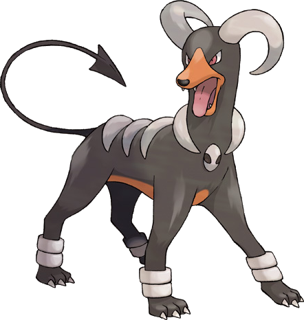

```{r setup, include=FALSE}
knitr::opts_chunk$set(echo = TRUE, message = FALSE,
                      warning = FALSE)
```

## Tree-Based Models

For this assignment, we will continue working with the file `"pokemon.csv"`, found in `/data`. The file is from Kaggle: <https://www.kaggle.com/abcsds/pokemon>.

The [Pokémon](https://www.pokemon.com/us/) franchise encompasses video games, TV shows, movies, books, and a card game. This data set was drawn from the video game series and contains statistics about 721 Pokémon, or "pocket monsters." In Pokémon games, the user plays as a trainer who collects, trades, and battles Pokémon to (a) collect all the Pokémon and (b) become the champion Pokémon trainer.

Each Pokémon has a [primary type](https://bulbapedia.bulbagarden.net/wiki/Type) (some even have secondary types). Based on their type, a Pokémon is strong against some types, and vulnerable to others. (Think rock, paper, scissors.) A Fire-type Pokémon, for example, is vulnerable to Water-type Pokémon, but strong against Grass-type.

{width="200"}

The goal of this assignment is to build a statistical learning model that can predict the **primary type** of a Pokémon based on its generation, legendary status, and six battle statistics.

**Note: Fitting ensemble tree-based models can take a little while to run. Consider running your models outside of the .Rmd, storing the results, and loading them in your .Rmd to minimize time to knit.**

### Exercise 1

Read in the data and set things up as in Homework 5:

- Use `clean_names()`
- Filter out the rarer Pokémon types
- Convert `type_1` and `legendary` to factors

Do an initial split of the data; you can choose the percentage for splitting. Stratify on the outcome variable.

Fold the training set using *v*-fold cross-validation, with `v = 5`. Stratify on the outcome variable.

Set up a recipe to predict `type_1` with `legendary`, `generation`, `sp_atk`, `attack`, `speed`, `defense`, `hp`, and `sp_def`:

- Dummy-code `legendary` and `generation`;
- Center and scale all predictors.

### Exercise 2

Create a correlation matrix of the training set, using the `corrplot` package. *Note: You can choose how to handle the continuous variables for this plot; justify your decision(s).*

What relationships, if any, do you notice? Do these relationships make sense to you?

### Exercise 3

First, set up a decision tree model and workflow. Tune the `cost_complexity` hyperparameter. Use the same levels we used in Lab 7 -- that is, `range = c(-3, -1)`. Specify that the metric we want to optimize is `roc_auc`. 

Print an `autoplot()` of the results. What do you observe? Does a single decision tree perform better with a smaller or larger complexity penalty?

### Exercise 4

What is the `roc_auc` of your best-performing pruned decision tree on the folds? *Hint: Use `collect_metrics()` and `arrange()`.*

### Exercise 5

Using `rpart.plot`, fit and visualize your best-performing pruned decision tree with the *training* set.

### Exercise 5

Now set up a random forest model and workflow. Use the `ranger` engine and set `importance = "impurity"`. Tune `mtry`, `trees`, and `min_n`. Using the documentation for `rand_forest()`, explain in your own words what each of these hyperparameters represent.

Create a regular grid with 8 levels each. You can choose plausible ranges for each hyperparameter. Note that `mtry` should not be smaller than 1 or larger than 8. **Explain why not. What type of model would `mtry = 8` represent?**

### Exercise 6

Specify `roc_auc` as a metric. Tune the model and print an `autoplot()` of the results. What do you observe? What values of the hyperparameters seem to yield the best performance?

### Exercise 7

What is the `roc_auc` of your best-performing random forest model on the folds? *Hint: Use `collect_metrics()` and `arrange()`.*

### Exercise 8

Create a variable importance plot, using `vip()`, with your best-performing random forest model fit on the *training* set.

Which variables were most useful? Which were least useful? Are these results what you expected, or not?

### Exercise 9

Finally, set up a boosted tree model and workflow. Use the `xgboost` engine. Tune `trees`. Create a regular grid with 10 levels; let `trees` range from 10 to 2000. Specify `roc_auc` and again print an `autoplot()` of the results. 

What do you observe?

What is the `roc_auc` of your best-performing boosted tree model on the folds? *Hint: Use `collect_metrics()` and `arrange()`.*

### Exercise 10

Display a table of the three ROC AUC values for your best-performing pruned tree, random forest, and boosted tree models. Which performed best on the folds? Select the best of the three and use `select_best()`, `finalize_workflow()`, and `fit()` to fit it to the *testing* set. 

Print the AUC value of your best-performing model on the testing set. Print the ROC curves. Finally, create and visualize a confusion matrix heat map.

Which classes was your model most accurate at predicting? Which was it worst at?

## For 231 Students

### Exercise 11

Using the `abalone.txt` data from previous assignments, fit and tune a random forest model to predict `age`. Use stratified cross-validation and select ranges for `mtry`, `min_n`, and `trees`. Present your results. What was the model's RMSE on your testing set?